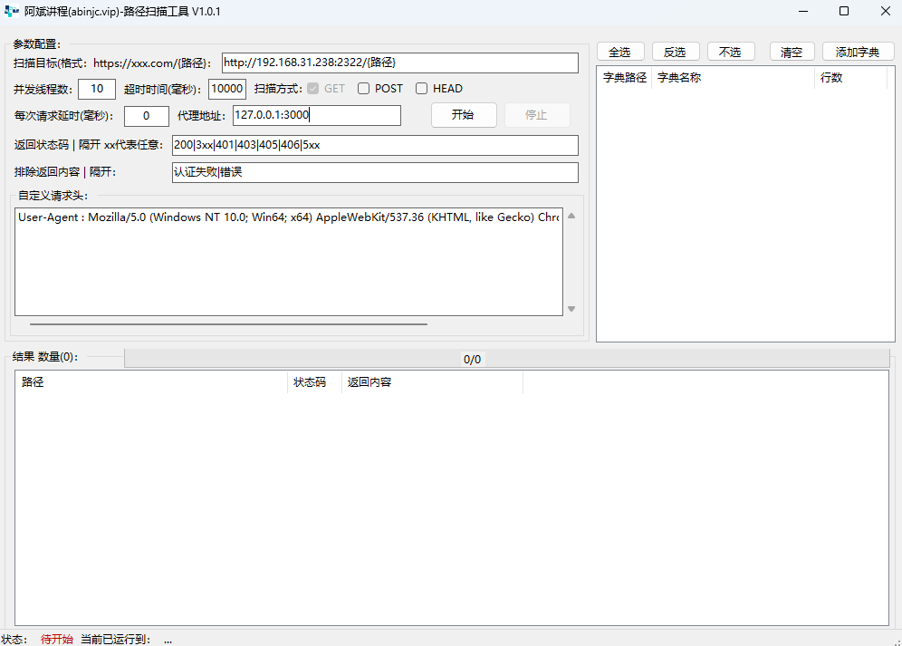

## 网站目录扫描工具-阿斌讲程
这是一个用于扫描网站目录结构的带界面GUI的工具，按照御剑和WebPathBrute的使用习惯重造的   
由于这两款工具都没有开源，又很久没维护，有各种潜在问题，比如win11无法运行，不能修改窗口大小   
github上开源的又全是python，没有gui的工具，是没有灵魂的！

### 程序截图
[]

### 使用说明
运行环境要求

.NET Framework 4.5+

注:Win10和Win11默认已经安装了.NET 4.5+环境。如果您的系统中尚未安装,请通过以下链接下载安装:   
<https://www.microsoft.com/zh-CN/download/confirmation.aspx?id=30653>

代理IP不需要写协议头，比如代理IP是 http://127.0.0.1:3000，只需要写127.0.0.1:3000就可以了
### 软件特点
1. 支持设置代理IP，理论不支持socks5，可以自行测试下，阿斌用的httphelper类的设置proxyip   
2. 支持设置排除返回内容，阿斌学Web安全的这段时间，发现很多站返回的虽然是200状态码，但是返回内容是显示错误的
3. 支持随意拖拉窗口，组件自适应宽高
4. 支持多选字典
5. 完整开源，可以随意二开，但是如果做成收费工具，麻烦小伙伴保留下版权哈哈

### 使用步骤

1. 下载 "网站目录扫描工具" 压缩包  
2. 解压缩到本地任意目录   
3. 双击运行 "abinjcWebPathBrute.exe" 主程序   
4. 在工具界面上输入要扫描的网站目标   
5. 点击 "添加字典"，选择需要的字典(程序目录下已自带一个字典列表，可以直接选择，按ctrl键多选文件导入)
6. 点击字典列表框的选择框，选中代表启用字典
7. 点击 "开始扫描" 按钮,等待扫描完成   

### 联系作者   
如果您在使用过程中遇到任何问题或有改进建议,欢迎通过以下方式联系阿斌:

QQ号：819267827   
微信号: liuhaibin28168
阿斌博客：<https://abinjc.vip>

## 阿斌刚学习web安全不久，还有很多概念没搞清楚，希望能跟各位大佬多交流一下